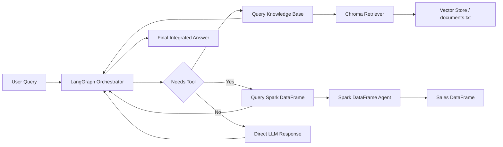

# Hybrid RAG Agent

A sophisticated AI agent that combines Apache Spark for structured data analytics with Retrieval-Augmented Generation (RAG) for unstructured knowledge querying, orchestrated through LangGraph.

## Features

- **Structured Data Analytics**: Query transactional sales data using Spark DataFrames with natural language
- **Unstructured Knowledge Base**: Retrieve relevant information from corporate policies and documents using vector search
- **Intelligent Orchestration**: LangGraph-based workflow that routes queries to appropriate tools
- **Robust Error Handling**: Comprehensive exception handling for production reliability
- **Modular Architecture**: Clean, maintainable code structure with proper logging and separation of concerns

## Architecture

The agent consists of:

1. **Spark DataFrame Agent**: Handles structured queries on sales data (revenue, employees, departments)
2. **Vector Store Retriever**: Searches unstructured corporate documents using embeddings
3. **LangGraph Orchestrator**: Routes user queries to appropriate tools and manages conversation flow
4. **OpenAI GPT-4 Integration**: Powers both the orchestrator and individual agents

## Workflow Diagram



## Prerequisites

- Python 3.13+
- Java 8+ (for Spark)
- OpenAI API key

## Installation

1. Clone the repository:
   ```bash
   git clone <repository-url>
   cd spark-rag-agent
   ```

2. Install dependencies:
   ```bash
   pip install -e .
   ```

3. Set up environment variables:
   ```bash
   export OPENAI_API_KEY="your-openai-api-key-here"
   ```

## Usage

Run the agent:

```bash
python main.py
```

The application will:
1. Initialize Spark session and sales DataFrame
2. Scan `data/raw_inputs/` directory for new documents via Spark Structured Streaming
3. Process and chunk documents incrementally with Spark workers
4. Sync chunks into Chroma vector database
5. Execute test query: "What were Alice's total sales revenues?"

## Configuration

### Spark Configuration
- **Driver Memory**: 4GB (configurable in [database/spark_session.py](database/spark_session.py))
- **App Name**: SparkRAGAgent
- **Streaming**: Structured Streaming with AvailableNow trigger (micro-batch processing)
- **Checkpoint Directory**: `data/spark_checkpoints/` (for recovery and state management)

### Vector Store Configuration  
- **Class**: `SparkVectorStoreManager` with Spark Structured Streaming integration
- **Storage**: Persistent Chroma database in `./chroma_db`
- **Embeddings**: OpenAI embeddings
- **Collection Name**: `corporate_knowledge`
- **Input Source**: `data/raw_inputs/` (monitored for new files)
- **Chunk Size**: 200 characters with 20 character overlap
- **Search Type**: Top-k retrieval (k=1)
- **Batch Processing**: Micro-batches are chunked with distributed UDF and written to Chroma

### LLM Configuration
- **Model**: GPT-4o
- **Temperature**: 0 (deterministic responses)
- **Instances**: Orchestrator LLM + Spark Internal LLM (isolated environments)

## Knowledge Base Setup

Add documents to the `data/raw_inputs/` directory. The system will automatically:
1. Monitor `data/raw_inputs/` via Spark Structured Streaming
2. Detect new files and read their content
3. Distribute text chunking across Spark worker nodes using UDF
4. Process micro-batches with `write_to_chroma_batch()` sink
5. Generate OpenAI embeddings and store in Chroma
6. Persist vector database for retrieval by the agent

**Example**: Create text files in `data/raw_inputs/`:
```
data/raw_inputs/policies.txt
data/raw_inputs/guidelines.txt
```

The streaming pipeline will auto-detect and ingest these files on the next `python main.py` execution.

## Development

The codebase has been refactored with a modular, production-ready architecture:

### Core Modules

#### Configuration (`config/settings.py`)
- **Directory Constants**: 
  - `INPUT_DATA_DIR = "data/raw_inputs/"` - Source for streaming document ingestion
  - `SPARK_CHECKPOINT_DIR = "data/spark_checkpoints/"` - Spark streaming state management
  - `CHROMA_PERSIST_DIR = "./chroma_db"` - Vector store persistence
  - `COLLECTION_NAME = "corporate_knowledge"` - Chroma collection identifier
- **`setup_environment()`**: Validates environment variables, configures PySpark Python paths, auto-creates missing directories
- **`LLMFactory`**: Factory pattern for managing discrete LLM instances (orchestrator and Spark internal)
- Centralized logging configuration with consistent formatting

#### Database Layer (`database/`)
- **`SparkManager` (`spark_session.py`)**: Manages Spark session lifecycle
  - Initializes SparkSession with 4GB driver memory
  - Provides `create_sales_dataframe()` for sample transactional data
  - Handles cluster context setup

- **`SparkVectorStoreManager` (`vector_store.py`)**: Advanced streaming-based knowledge base ingestion
  - **Distributed Text Chunking**: `split_text_chunks()` UDF processes documents across Spark workers
  - **Structured Streaming Pipeline**: Monitors `data/raw_inputs/` for new files with AvailableNow trigger
  - **Batch Sink**: `write_to_chroma_batch()` processes micro-batches and writes to Chroma with metadata
  - **Checkpoint Management**: Maintains state in `data/spark_checkpoints/` for fault tolerance
  - **Initialization**: `_ensure_database_exists()` pre-creates Chroma collection on startup
  - **Retrieval**: `get_retriever()` returns configured vector search client (k=1)
  - Documents are automatically chunked (200 chars, 20 overlap), embedded via OpenAI, and persisted

#### Agent Layer (`agent/`)
- **`RAGGraphBuilder` (`graph.py`)**: Assembles LangGraph state machine workflow
  - Manages `AgentState` with message annotations
  - Implements `_call_model()` for LLM invocations
  - Implements `_should_continue()` for conditional routing to tools
  - Builds compiled workflow graph with proper edge definitions

- **`create_agent_tools()` (`tools.py`)**: Factory creating atomic tool nodes
  - `query_knowledge_base`: Searches corporate policies via vector retriever
  - `query_sales_records`: Queries structured data using Spark DataFrame agent
  - Includes error handling with fallback responses and logging

#### Entry Point (`main.py`)
- Initialization sequence: 
  1. Setup environment (directory creation, API key validation)
  2. Create Spark session and sales DataFrame
  3. Initialize vector store manager and trigger file sync
  4. Run `sync_new_files()` - Spark Structured Streaming pipeline processes `data/raw_inputs/`
  5. Get retriever client for LLM access
  6. Create agent tools and build LangGraph workflow
- Executes test query: `"What were Alice's total sales revenues?"`
- Comprehensive exception handling at process level with critical logging

## Code Refactoring Changes

### Advanced Distributed Architecture
1. **Spark Structured Streaming**: Incremental file ingestion via `SparkVectorStoreManager` with AvailableNow trigger
2. **Distributed Text Chunking**: UDF-based processing across Spark worker nodes for scalability
3. **Micro-batch Sink Pattern**: `write_to_chroma_batch()` processes and writes chunks to Chroma with UUID tracking
4. **Fault Tolerance**: Checkpoint-based state management in `data/spark_checkpoints/`
5. **Auto-Directory Creation**: Configuration setup ensures required directories exist

### Architecture Improvements
1. **Modular Infrastructure**: Separated concerns into dedicated manager classes (`SparkManager`, `SparkVectorStoreManager`, `LLMFactory`)
2. **Factory Pattern**: `LLMFactory` and `create_agent_tools()` for flexible component creation
3. **Dependency Injection**: SparkSession passed to vector manager for distributed processing
4. **Type Annotations**: All functions include type hints for better IDE support and code clarity
5. **Centralized Configuration**: Constants defined in `config/settings.py` for easy management

### Code Organization
- **`config/`**: Environment setup, directory paths, and factory configurations
- **`database/`**: Spark and streaming vector store management
- **`agent/`**: LangGraph orchestration and tool definitions
- **`data/`**: Raw inputs (monitored), checkpoints, and vector database storage

### Streaming & Distributed Processing
- **File Monitoring**: Automatic detection of new files in `data/raw_inputs/`
- **Distributed Chunking**: Text splitting via Spark UDF across all worker nodes
- **Batch Processing**: Micro-batches with UUID-based document tracking
- **State Management**: Checkpoint location prevents duplicate processing
- **Incremental Ingestion**: Only new files trigger re-processing via AvailableNow trigger

### Error Handling & Robustness
- Validation of required environment variables at startup
- Directory creation with `exist_ok=True` for safe initialization
- Error boundaries in tool execution with graceful fallbacks
- Detailed logging of file sync, batch processing, and failures
- Try-catch blocks at orchestration and batch processing levels

### Performance & Configuration
- **Distributed Processing**: Spark worker nodes handle text chunking in parallel
- **Incremental Sync**: Only new files are processed (stream-based, not batch)
- **Configurable Spark Memory**: Default 4GB driver memory
- **Chunk-based Splitting**: 200 chars, 20 overlap for optimal embedding context
- **Top-k Vector Search**: k=1 for focused retrieval
- **Deterministic LLM**: Temperature=0 for consistent responses
- **Persistent Storage**: Chroma database survives across runs

## License

[Add your license here]
